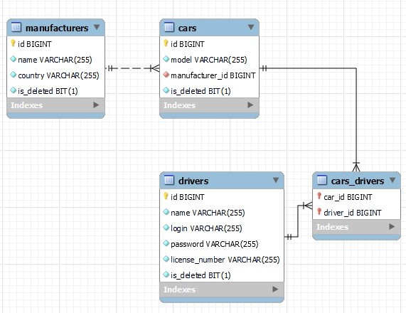

# Taxi service

This is a simple web app for simulating taxi service based on Stateful Web Service,
at first you have to pass authentication or create a new driver which login and password
will be your for authentication to the service.

## Project description:

* Ability to create driver, manufacturer or car
* Ability to delete driver, manufacturer or car
* Ability to get all drivers, manufacturers or cars
* Ability to add driver by driver id to car by car id
* Ability to see your current cars

## Implementation details in project:

* 3 layer architecture
    - Controllers
    - Services
    - DAO
* Dependency injection and Inversion of control
* Relations many to one, many to many

## Technologies used in project:

* Apache Tomcat (v9.0.55)
* JDBC
* MySQL
* Servlet
* JSP
* JSTL
* HTML, CSS
* Maven
* Maven checkstyle plugin

## Recommendations to run project:

* Intellij IDEA Ultimate Edition
* Apache Tomcat version 9.0.55
* MySQL and MySQL Workbench
* Create a schema like in resources/init_db.sql in MySQL Workbench
* Add your DB Properties in ConnectionUtil class
* Edit your Tomcat configuration
* After running tomcat go to http://localhost:your port and create a new driver
* For using logger change full path in log4j2.xml file

